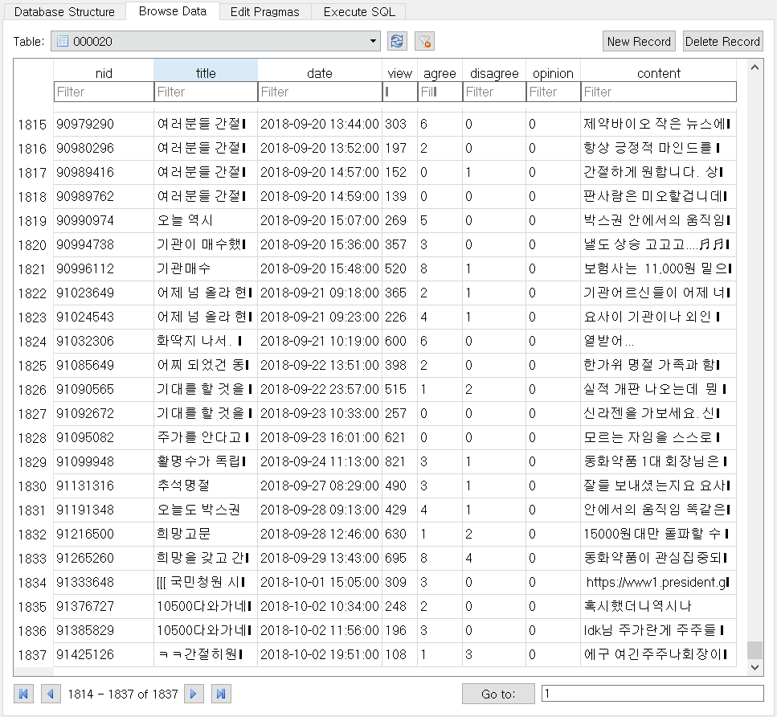

# naver-finance-board-crawler
네이버 금융의 종목토론실 크롤러입니다. (종목토론실: https://finance.naver.com/item/board.nhn?code=000020)
BeautifulSoup4에 lxml parser를 사용하였고 Multiprocessing, Multithreading으로 속도를 높였습니다.  
한 번 로컬에 데이터를 구축하면, 다음 번 실행 시에는 로컬에 없는 데이터만 받아옵니다.

## Preview
##### 실행화면

##### 저장 형식 (DB Browser for SQLite 실행 화면)

## 실행 환경 세팅
OS: Window 10
1. `conda create -n NEW_ENV_NAME python=3.7.0`
1. `activate NEW_ENV_NAME`
1. `conda install requests BeautifulSoup4 lxml pandas sqlite`
  
## 실행 방법
방법1. `python main.py` (os.cpu_count()개수의 프로세스 사용)  

방법2. `python main.py -n 2` : 2개 프로세스 사용

## 생각
requests.get() 응답을 기다리는데에 대부분의 시간이 소요됨. -> async requests??
